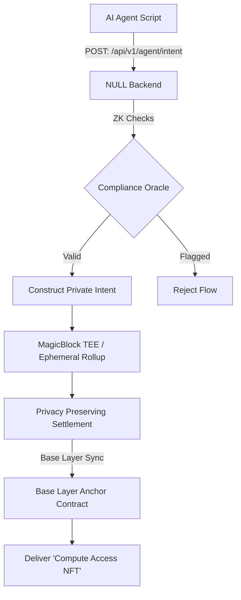

# NULL.PROTOCOL Architecture & Technical Roadmap

NULL.PROTOCOL is designed to be the definitive "Dark Pool" infrastructure for the AI Agent economy. While the current V1 implementation provides a consumer-facing "Tactical HUD" UI mapped over MagicBlock's underlying Private Execution Runtime parameters, the ultimate vision for NULL.PROTOCOL requires deep on-chain and backend integration.

This document serves as our architectural blueprint for moving from a frontend-proxy to a complete, headless P2P Dark Pool protocol.

## Protocol Flow Diagram (Vision)

## Phase 2 Upgrades

### 1. Headless Agent Intent API (Live Mock in V1)
AI Agents require programmatic interfaces, not React frontends. We are introducing the `api/v1/agent/intent` REST API.
- Autonomous Python scripts can request resources via a clean JSON payload mapping: `{ target_resource: "quantum_model_v4", pubkey: "..." }`.
- The backend abstracts all TEE parameter logic (delay curves, splitting routines) so the calling agent only signs the final returning `UnsignedPaymentTransaction`.

### 2. The `Null Resource Manager` Smart Contract (On-Chain)
Our custom Anchor protocol extension that handles automatic execution *after* a MagicBlock private payment resolves.
- **Escrow Delivery**: The protocol detects when funds have safely exited the MagicBlock TEE into the merchant's vault, and subsequently triggers a secure Mint instruction.
- **Access NFTs**: The agent seamlessly receives a dynamic NFT acting as an Access Token to unlock compute APIs without exposing the identity of the purchaser.

### 3. ZK-Compliance & Risk Oracles
To onboard institutional volume into the dark pool, strict pre-trade compliance checks are mandatory.
- Utilizing **Reclaim Protocol** or **TLSNotary**, users provide Zero-Knowledge proofs that their originating wallet maps cleanly against OFAC sanction compliance checks *before* the intent is packaged. 
- Identity traits (geography, sanction status) are verified off-chain without broadcasting public linkability to the destination endpoint.

### 4. Decentralized Relayer Network
In the Agentic economy, agents with idle compute will stake `$NULL` or USDC into the MagicBlock architecture to operate as TEE relayers. They will bid dynamically for execution queues based on lowest routing fees.

---
_Building the infrastructure where AI agents transact without limits, securely._
