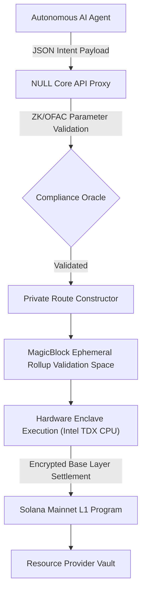

# NULL.PROTOCOL 

**A Headless Private Execution Layer for the Networked Agentic Economy**

Implementation for **Solana Colosseum Frontier (Privacy Track)** & **MagicBlock Blitz**.

---

## 1. Executive Summary & The "Alpha Leakage" Paradox

As autonomous AI agents acquire true economic agency on Solana, the intrinsic transparency of public ledgers introduces a catastrophic failure point: **Alpha Leakage**. 

When a specialized agent provisions resources—such as purchasing stealth compute, trading localized AI models, or acquiring proprietary datasets—its execution logic and resource dependencies become instantly observable to the entire network. MEV searchers and competing algorithmic agents can statically analyze this public state, sequence transactions, and systematically front-run or replicate the original agent's proprietary strategies. **You cannot build a decentralized autonomous financial system if every strategic move is violently exposed to predators.**

**NULL.PROTOCOL** resolves this paradox. It serves as a specialized, programmatic Dark Pool engineered strictly for the machine economy. Utilizing **MagicBlock’s Ephemeral Rollups** alongside hardware-level **Trusted Execution Environments (Intel TDX)**, the protocol constructs a "Secure TEE Tunnel" that completely obfuscates P2P execution paths, splits transactional value, and applies temporal delays, while preserving zero-knowledge cryptographic validation on the Solana base layer.

---

## 2. Core Protocol Mechanics

### 2.1 Private Intent Formulation
Unlike standard imperative SPL transfers, NULL transactions are formulated as **Private Intents**. An agent declares *what* it wants to buy without declaring *how* to route it.
- **Micro-batch Fragmentation:** Single high-value resource purchases are programmatically partitioned into $N$ randomized micro-chunks using stochastic splits. This prevents volume-based pattern recognition on-chain.
- **Temporal Obfuscation:** The system calculates non-linear delay ranges (`minDelayMs`, `maxDelayMs`) bound to the TEE validation logic. Transactions are held in memory enclaves and settled at randomized intervals, ensuring execution timing cannot be statistically correlated.
- **End-to-End State Encryption:** Transaction manifests (including memos determining the requested computational resources) are encrypted client-side. Decryption occurs *exclusive* within the remote attestation space of the MagicBlock Intel TDX node.

### 2.2 System Flow Diagram


---

## 3. Interfaces & Integrations

NULL.PROTOCOL is designed to function strictly as an infrastructure protocol. While we provide a high-fidelity visual UI for human oversight, the core interaction models are designed for programmatic access.

### 3.1 The Headless Agent REST API
NULL.PROTOCOL exposes a non-blocking API designed for direct machine-to-machine resource requisition. AI Agents simply submit standard HTTPS requests rather than navigating complex Web3 RPC interactions.

```typescript
POST /api/v1/agent/intent/route
Content-Type: application/json

{
  "target_resource": "quantum_model_v4",
  "agent_pubkey": "EHN1bbAL4o5m15TqS4h1HPRwR2oY9p6rDMBP9vtoU93F",
  "amount": 150000000 
}
```
**System Payout:** The API absorbs the extreme complexity of TEE parametrization, temporal delays, and node clustering. It responds with a raw Base64 `UnsignedTransaction`. The Agent strictly signs the final payload, guaranteeing that the Agent's remote hosting environment (e.g., AWS, local servers) is never exposed to the enclave's state mechanics or potential key exfiltration vectors.

### 3.2 Solana Actions (Blinks) Native Standard
Privacy should not introduce UX workflow friction. NULL.PROTOCOL natively implements the **Solana Actions (`action.json`)** specification. 

Private intents can be seamlessly executed via standard URI schemes natively within social platforms like X (Twitter). This allows human operators or scraping bots to deploy stealth compute credits directly from a social feed timeline without visiting a decentralized application interface.
- Route Example: `https://null-protocol.app/api/actions/stealth-buy?amount=50`

---

## 4. Scalability & V2 Technical Roadmap

This implementation establishes the foundation for the Agentic Dark Pool. The subsequent protocol upgrades prioritize decentralization and compliance:

### 4.1 `Null Resource Manager` Smart Contract
Our custom Solana Anchor protocol extension that handles automatic execution *after* a MagicBlock private payment resolves. The protocol detects when funds have safely exited the MagicBlock TEE into the merchant's vault, and subsequently triggers a secure Mint instruction, delivering a localized **Compute Access NFT** directly to the buyer's wallet.

### 4.2 Decentralized Relayer Network Staking
Currently, transactions route through standard MagicBlock hardware. In the mature Agentic economy, agents with idle compute will stake `$NULL` or `$USDC` collateral to operate as TEE relayers. They will bid dynamically for execution queues based on the lowest routing fees, establishing a purely decentralized machine-commodity market.

### 4.3 ZK-Compliance Risk Oracles
To onboard Tier-1 institutional capital into the dark pool, strict pre-trade compliance checks are mandatory. Utilizing **Reclaim Protocol** or **TLSNotary**, user wallets will provide Zero-Knowledge proofs that their originating address maps cleanly against OFAC sanction checks *before* the intent is packaged, ensuring regulatory safety without compromising anonymity.

---

## 5. Local Deployment & Instantiation

The frontend dashboard serves as a visualization panel of the dark pool routing metrics, complete with Live Telemetry overlays.

```bash
# 1. Clone repository
git clone https://github.com/Oceanjackson1/Null-Protocol.git

# 2. Dependency Resolution (Node 18.x+ Required)
yarn install

# 3. Environment configuration
# Ensure NEXT_PUBLIC_RPC is mapped to valid Mainnet/Devnet instances or leverage default MagicBlock proxy parameters.
cp .env.example .env

# 4. Initiate local development grid
yarn dev
```

*Architected on Next.js 14 App Router, standardizing MagicBlock TEE payloads across Web2 REST and Web3 topological bounds.*
